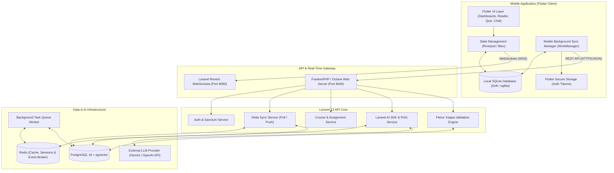
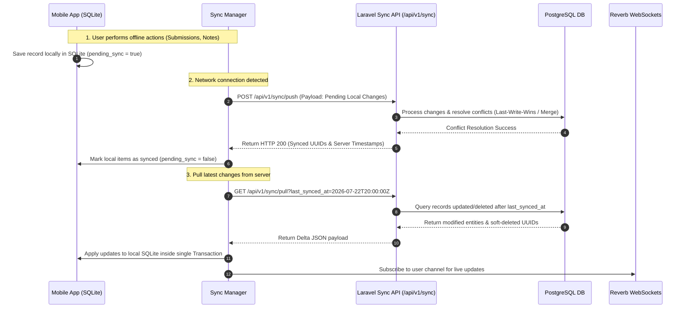
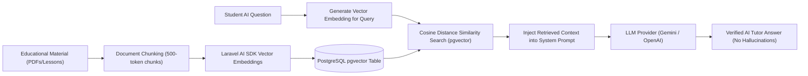
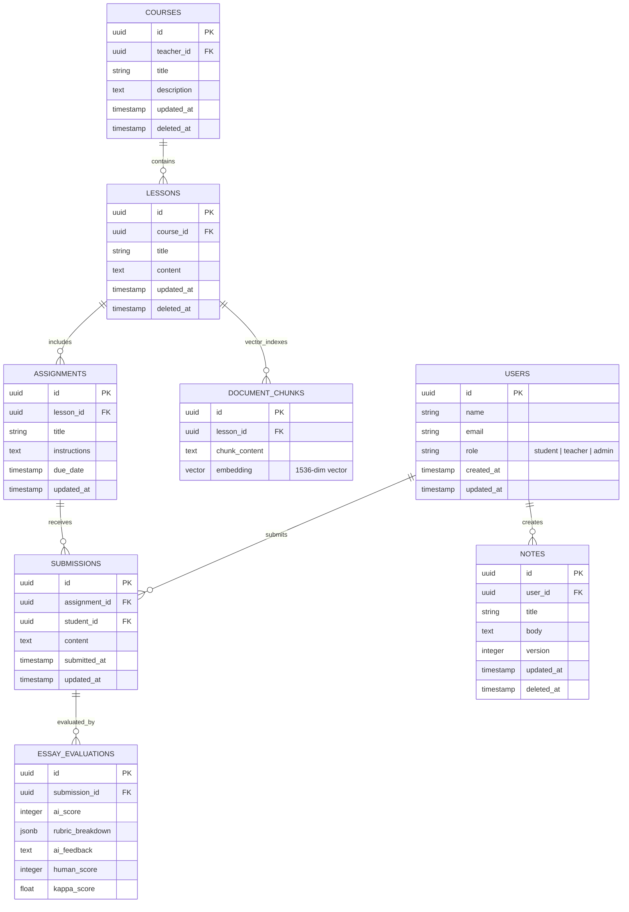

# System Design Specification: EduBridge AI

**Project Name**: EduBridge AI  
**Architecture Type**: Offline-First Distributed Systems + AI RAG Engine  
**Backend Framework**: Laravel 13 (FrankenPHP / Octane)  
**Database**: PostgreSQL 16 with `pgvector` & Redis  
**Mobile Client**: Flutter (Offline SQLite / Drift Local Database)

---

## 1. Executive Summary

**EduBridge AI** is an offline-first educational platform designed for region-resilient learning. Students can study, complete assignments, take quizzes, and write notes entirely offline on their mobile devices. Whenever network connectivity is detected, a background delta synchronization engine securely exchanges data updates with the central Laravel API server while resolving data conflicts.

Furthermore, the platform integrates **Retrieval-Augmented Generation (RAG)** for AI tutoring and an **AI Essay Evaluation engine** backed by **Fleiss' Kappa** inter-rater statistical validation.

---

## 2. High-Level System Architecture

The following diagram illustrates the complete system architecture and boundary separation between the mobile app, offline local storage, central API gateway, real-time WebSocket layer, AI vector search engine, and background task processing.

---

## 3. Offline Synchronization Protocol (Push / Pull)

The synchronization engine uses a **timestamp-based incremental delta protocol** to ensure low bandwidth consumption and reliable offline state recovery.

### 3.1 Push / Pull Sequence Diagram

---

## 4. AI RAG & Essay Evaluation Architecture

### 4.1 Retrieval-Augmented Generation (RAG) Flow

### 4.2 Fleiss' Kappa Statistical Agreement Engine

To validate AI essay evaluations against human teacher grading:

1. Ratings are categorized into $K$ discrete grade bands (e.g., _Excellent_, _Good_, _Average_, _Poor_).
2. Human teacher grades ($r_1, r_2$) and AI scores ($r_{\text{ai}}$) form an evaluation matrix for $N$ essays.
3. The system computes **Fleiss' Kappa** ($\kappa$):
   $$\kappa = \frac{\bar{P} - \bar{P}_e}{1 - \bar{P}_e}$$
4. If $\kappa \ge 0.75$, AI grading is certified as highly reliable. If $\kappa < 0.40$, the system flags prompts for recalibration.

---

## 5. Database Schema & Data Models (PostgreSQL & SQLite)

### 5.1 Entity Relationship Overview

---

## 6. Security & Real-Time Communication

- **Authentication**: Laravel Sanctum bearer tokens stored securely in `flutter_secure_storage` on mobile.
- **WebSocket Security**: Private channels authenticated via Sanctum (`private-user.{userId}`).
- **Data Protection**: Local SQLite database encrypted using SQLCipher on mobile devices.
